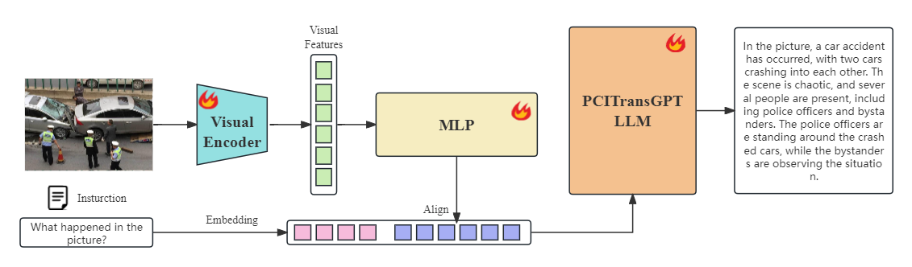

# PC_TransCore-M

Details and codes will be released soon. Stay tuned! 



<center>TransCoreM model architecture</center>


# Overview
PCI TransCore-M is a multimodal model, it's composed of a visual encoder and a language model. It enables content comprehension, recognition and multi-round conversations about pictures.

- **Visual Encoder:** CLIP ViT-L/14
- **Pre-trained LLM:** TansCore-M

# Install
Our install environment：NVIDIA A800-SXM4-80GB，CUDA Version: 11.7

Pull project and install some library:
```shell
git clone https://github.com/PCIResearch/TransCore-M.git
cd TransCore-M
conda create -n transcorem python=3.10 -y
conda activate transcorem

pip install -r requirements.txt -i https://pypi.tuna.tsinghua.edu.cn/simple
```

# Weights

1. Vision encoder weight: https://huggingface.co/openai/clip-vit-large-patch14-336

2. TransCore-M weight: https://huggingface.co/PCIResearch/TransCore-M

# Inference

```shell
cd TransCore-M
CUDA_VISIBLE_DEVICES=0 python inference.py --model-path ./weights/transcorem_pci-v1.1_20231112 --vision-path ./weights/clip-vit-large-patch14-336

Note: 
The default setting in our code for the vision encoder model is to actively download openai/clip-vit-large-patch14-336. 
But due to the slow network speed to download vision encoder model by default, you can download the vision encoder in advance and then specify the path to the clip model in the terminal where the python script is started.
Our vision encoder model： clip-vit-large-patch14-336, you can download from https://huggingface.co/openai/clip-vit-large-patch14-336
```

# Demo
demo: [demo_link](http://123.249.36.167:82/?wework_cfm_code=OUGvQ%2BJaUrnG4qWwQQ3TCHPRNka5YXBQWGQa%2FTC2bCAm8PKw9d%2F6EwBCvtiSYljSsWs6t1Odmh%2FemGunAy8KKx4%3D)


# 声明
PCI TransCore-M 模型旨在提升技术领域的研究和应用效率，我们
鼓励和欢迎开发者及社区成员共同遵守相关开源协议，确保技术的正当和安全使用。请广大用户注意，不得将此模型及其衍生代码用于任何可能对国家安全和社会稳定造成威胁的活动，以及未经过严格安全评估和官方备案的服务。

PCI TransCore-M 模型在设计和训练过程中尽量保证数据的合规性和准确性，但由于其复杂性和概率性的特点，我们无法完全保证输出内容的百分百准确无误。此外，模型输出结果可能受到用户输入内容的影响而产生偏差。因此，我们不对由于使用本模型而引起的任何数据安全问题、舆论风险、误导信息的传播或任何形式的不当使用承担责任。
